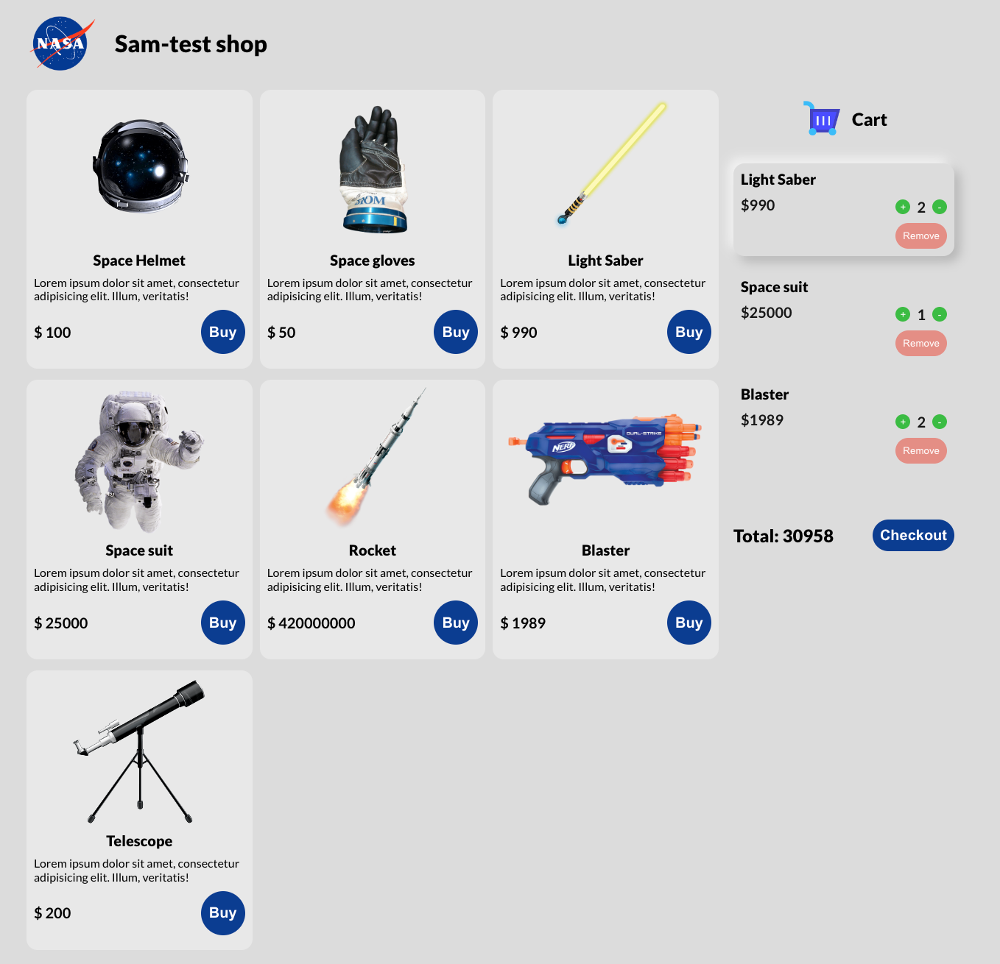

### Template
- yarn create react-app my-app --template redux-typescript
### Tools:
1. [TypeScript](https://www.typescriptlang.org/)
2. [React](https://reactjs.org/)
3. [Redux](https://redux.js.org/)
4. [Redux Toolkit](https://redux-toolkit.js.org/)
5. [styled components](https://styled-components.com/)
6. [eslint / prettier](https://github.com/GlebPilipenko/eslint-prettier)
7. [React modal](https://github.com/reactjs/react-modal)

### Screenshot
